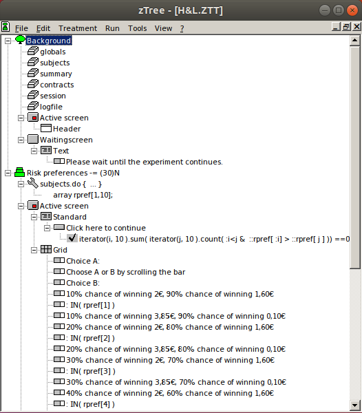
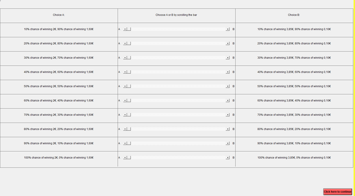
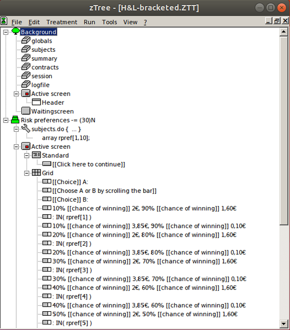
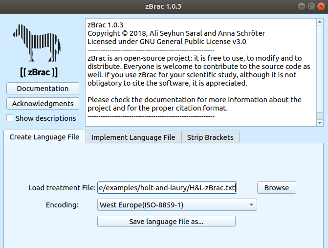
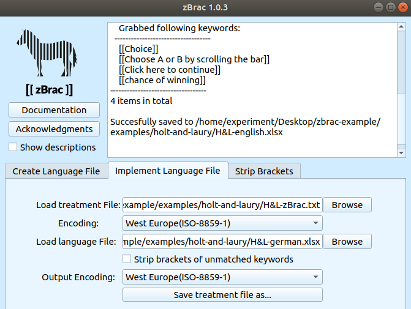
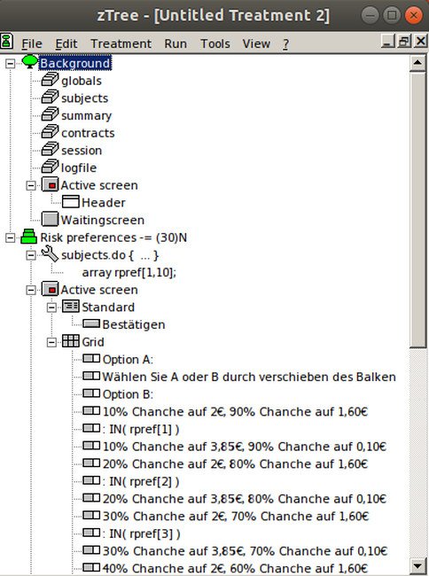
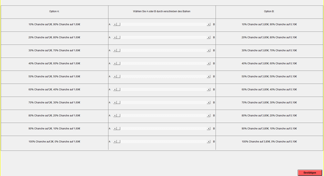

[](https://www.gnu.org/licenses/gpl-3.0)
[](https://badge.fury.io/py/zbrac)


# zBrac : A multilanguage tool for z-Tree


Created by Ali Seyhun Saral and Anna Schroeter  
Released under GNU General Public License v3.0  
  
## About the project
zBrac[1] is a tool to facilitate text modification of z-Tree[2] treatment files. With zBrac, you can export specified text into *a language file* and import it back after the text modification or translation. The main advantage of using zBrac is that the coding and text/editing can be done independently.

zBrac's design is specifically tailored for cross-cultural studies: You can code your experiment once, send out excel sheets to translators and later implement those translations into your code directly from the file at any time. zBrac also tries to tackle the issues with special characters in z-Tree by offering different encoding options.

zBrac is particularly useful when the treatment file contains the same piece of text several times. Such duplicated pieces of texts are very common in z-Tree programming as it is often needed to copy-paste stage tree elements. zBrac recognizes each unique key as a single key and it would be enough to provide the text to replace for this key at once. For an example, please see below for the Holt and Laury measure example.

 **zBrac is free/open-source software (See GNU GPL-3 License). You can use, modify and distribute it. It is not obligatory to cite the software, although it is highly appreciated (see below for citation information).**

### Citing the software
Our paper that introduces zBrac and discusses its implications is accepted by *Journal of Behavioral and Experimental Finance* and still in press. If you use the software and would like to cite the paper, please visit this page or feel free contact us before you share your manuscript.

## Installation
zBrac is a cross-platform software, meaning that it can be run under major operating systems. For now, we have an installation package availabe for Windows. For other platforms, it can be installed via pip.

### Installation with Windows Installer

You can get the installer from releases page:

[Releases : Latest Release](https://github.com/seyhunsaral/zbrac/releases/latest)


### Installation with pip (Windows, GNU/Linux, MacOS)

If you have Python(>=3.6) and pip on your computer you can install zBrac from comannd line with the following command:

`pip3 install zbrac` ( or `pip install zbrac` if pip is for Python 3)

Then if python binary folder is set up properly, `zbrac` command opens the software. zBrac can also be run with a python interpreter:

```
import zbrac
zbrac.interface.startgui()
```

## Design
### Keys
zBrac recognizes the text that are enclosed in double brackets: `[[This is a text]]`. Each piece of text indicated as such are called "*keys*"

Each key acts as a placeholder and later can be to be replaced by another text.

To give an example, if you'd like to add a welcome message on your zTree file, but you are not sure about the exact message at that point, you can just put `[[welcome message]]` in the desired place.

If you like to use zBrac on your own code and if your treatment file is already written, the text in your file should be enclosed by `[[` and `]]`. If you will write a zTree treatment from scratch, it is more efficient to write the desired text in double brackets while programming. Afterwards the brackets can easily deleted at once by using the *Strip Brackets* function of zBrac.

### Language files (xlsx)
A language file is an excel file which in each row contains a key in the first column, and a text to replace the key with in the second column. For instance, once we have our welcome message, an excel file, a file that follows the strucure below can be used to replace the key with the text in the second column:  

| (column1)  | (column2) |
| ------------- | ------------- |
| [[welcome message]]| Welcome to our experiment |

If you would like to have your experiment in different languages, ideally each one of them should have its own language file.

### Treatment files (txt)
Treatment files are basically zTree treatment files in TXT. They can be exported/imported using zTree. 

### Summary
To prepare your treatment file(ZTT) to work with zBrac, you should:
* Define the text by adding double brackets at the beginning and at the end of the text. (ie. `[[this is my text]]`)
* Export your file as a text file by using zTree

## Example: Translating Holt and Laury Measure[3]

Here we demonstrate how to use zBrac by using a Holt & Laury Measure of Risk Aversion from English to German.[4]

This is the english version we started with:



and the file looks like this on the client screen:
 


First we enclose all the text we want to modify with double brackets. The file now looks like this: 



Then we exported the file to a text file by clicking: 
`File` > `Export` > `Treatment`.

The exported TXT files with brackets act like our master file. We can replace the values of the keys by using a treatment file.

We can either prepare a language file with the format described above, or we can generate a language file template by using relevant function of zBrac. We will do the second.  
We choose the `Create Language File Template` function and save the language file.



This language file template now looks like this. In the first column it contains keys, in the second column it contains values that were generated by removing the brackets from each key:


We create a German language file by translating the second column.

Notice that the original treatment file contains 40 duplicates the text "chance of winning" and with zBrac we modifiy that text only once. 


To replace the German text with the keys, we go to `Implement 
Language File` tab and specifiy the treatment file and the language file that contains our translation.




We click `Save treatment file as...` to create a translated version of our treatment file and save it. 

Finaly we go back to zTree and choose `File` > `Import` and select our translated treatment file. This is what our final result looks like:






## Contributing

Guidelines for contributing will be available soon. But feel free to create an issue or a pull request if you have suggestions.

## FAQ
 **Will the brackets  be visible when I add them into my code?**  
 - Yes, until you replace them by using a language file, they will be visible. However *stip brackets* function allows you to delete them all at once, so that during the testing process, you can just check how do they look without the brackets. 
 
 **Why double brackets? A single bracket or ____ would be better, wouldn't it?**  
 -As zBrac modifies the exported text file created by zTree in a certain structure, we have to pick an operator according to these criteria:

* **No interference with the zTree code itself**: We have to pick an operator rarely exist in a typical zTree code. For that reason we scanned for several zTree files we collected and chose double brackets accordingly as they are highly unlikely to interfere with your code[5].

* **Easy to type**: Double brackets are relatively easy to type. With a US keyboard layout it takes just a pair of double-keystrokes to write them. In most of the European layouts, an additional AltGr should accompany those keystrokes.

* **Easy to read**: Double brackets were much easier to read than other candidates we qualified according to the criteria above.

**I would like to automatize my workflow. For that reason I want to use command line to generate my treatment files with zBrac. Is it possible?**  
-This feature is on our list. We already designed zBrac functions to be able to work independently and they are accessible in our python packet with `zBrac.functions.*functionname*`. But documentation of these features and implementation of the command line functionality is still in progress.

**Why citing zBrac is not a requirement?**  
-For a truly free software spirit, we wanted to use GNU GPL-3 License and a citation requirement would not be compatible with that licence. We do not think using GPL-3 should be the norm, but it is just a matter of choice of the authors. We still believe that citing open-science tools are beneficial for increasing the visiblity of those tools and it is highly appricated.

**Why language files are in Microsoft Excel format? Doesn't it contradict with your free software spirit?**  
-For the language files, we needed to have a format that allows multiple encodings while being widespread and easy to work on. Unfortunately `CSV` format doesn't satisfiy these criteria. Moreover there are fantastic free software tools such as LibreOffice that allows to create and edit XLSX files. 

**Can I google translate my text with zBrac?**  
-Not directly, but it just takes few seconds to copy and paste relevant column to google translate interface and then putting it back to a language file. 

**How can I contribute?**  
-Currently we do not have to pay any costs related with the project and we do not expect to do it in the feature as well. Therefore we do not expect a financial contribution to the project. Contributing to the source code, reporting bugs, requesting features, and contributing to the documentation are more than what we can hope for.  

**Why did you make it as a desktop software? Why didn't you just create a web page with the same functionality?**  
-The first reason is that maintaining a web server is both costly and time consuming and we are not able to handle it at the moment. And the second reason, for the users, downloading the python source code and making modifications with it is much easier if a software is in a self-contained package form. For these reasons we believe that the current form is an optimal way to publish the software. 

## Acknowledgements
zBrac is designed and built at the Max Planck Institute for Research on Collective Goods in our free time. We used Python 3.6 and Qt5 to build it. We like to thank to those who attended the internal presentation of the project and provided their comments and suggestions.

We would like to thank specifically Zvonimir Bašić, Philip Brookins, Brian Cooper, Andreas Drichoutis, Christoph Engel, Zwetelina Iliewa, Matteo Ploner, Piero Ronzani, Marco Tecilla and Fabian Winter for their valuable comments and/or for their help. 

## References and Footnotes
[1] :  The name zBrac is a portmanteau of the words zTree and brackets. 
It is pronounced ˈzibrək, like zebra (that's where the logo comes from)


[2] : Fischbacher, U. (2007). z-Tree: Zurich toolbox for ready-made economic experiments. Experimental economics, 10(2), 171-178.

[3] : Holt, C. A., & Laury, S. K. (2002). Risk aversion and incentive effects. American economic review, 92(5), 1644-1655.

[4] : We used a sample sent to the z-Tree mail group. Credits : Andreas Drichoutis

[5] : There is one case that you might need to use double brackets, that is, when you need nested arrays. For instance `myarray[anotherarray[1]]`. Unless there is an already open double bracket, zBrac would work fine. Otherwise adding space between array those double brackets such as `myarray[ anotherarray[1] ]` would fix a potential issue.
